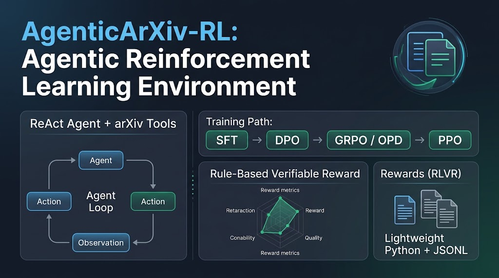

<p align="center">
  <a href="README.md">🇨🇳 中文</a> | <a href="README.en.md">🇬🇧 English</a> | <a href="README.es-ES.md">🇪🇸 Español</a>
</p>

# AgenticArXiv-RL — Agentic RL 训练环境

> **基于 ReAct Agent + arXiv 工具的 Agentic RL 训练环境**
> 支持 SFT/DPO/GRPO/OPD 训练路径与可验证奖励（RLVR），用于研究 LLM Agent 强化学习。
> 终极目标：**端侧部署的轻量多模态论文助手**——从检索、下载、翻译到总结、识图的端到端论文阅读模型。

<p align="center">
  
</p>

---

## 🎯 项目定位

将 arXiv 论文检索/下载/翻译/解读任务改造为**可训练的强化学习环境**，专注于：

1. **Verifiable Reward**：基于规则化奖励（工具调用准确度、任务完成度、解析错误等），无需人类标注
2. **渐进式训练**：SFT → DPO → GRPO（另提供 OPD on-policy 蒸馏路线；PPO 在当前依赖下不可用）
3. **轻量级工程**：纯 Python + JSONL 存储，无数据库、无前端，专注离线训练

**非目标**：生产级 arXiv 应用、Web UI、实时翻译服务（原 Web 应用已从本仓库移除，见原版 [AgenticArXiv](https://github.com/Algorineko/AgenticArXiv)）。

### 可选 Jev 工具路由实验

普通 ReAct 推理支持默认关闭的 Jev next-tool router：Jev 选择下一步工具，guided 模式
用确定性解析器处理显式参数，含糊参数仍交给策略模型，环境继续执行工具。默认
`TOOL_ROUTER=policy` 完全保留原行为；显式设为 `jev` 后，低置信度、API 故障或参数
验证失败都会回退原策略路径。该功能不接入 GRPO 训练。配置、baseline、81 条
routing-only pilot、限制与复现方式见
[JEV_ROUTER.md](JEV_ROUTER.md)，可复制的开关/API 配置见
[jev_config.example.env](jev_config.example.env)。另有无需 GPU/网络的 project-interface
smoke，验证 policy/Jev 两条路径可经过同一 ReAct、环境和 benchmark 接口互换。真实
GRPO Qwen 的 mixed 10-task、repeat=3 小样本中，guided Jev 将 strict success 从 40%
提高到 60%，本地 Qwen token 减少 74.01%，总延迟增加 36.96%。该结果是小样本结构
验证，不代表完整 81 题总体胜率。

---

## 🚀 快速开始

```bash
# 1. 克隆并安装（Python 3.9+）
git clone https://github.com/Algorineko/AgenticArXiv-RL.git
cd AgenticArXiv-RL
python3 -m venv .venv && source .venv/bin/activate
pip install -r AgenticArxiv/requirements.txt

# 2. 配置 LLM API（API rollout 需要；本地模型训练/评测不需要）
cat > AgenticArxiv/.env << 'EOF'
LLM_BASE_URL=https://api.openai.com/v1
LLM_API_KEY=sk-your-api-key
MODEL=gpt-4-turbo
EOF

# 3. 测试 Rollout（奖励范围 [-1, 1]，随轨迹变化）
python -m AgenticArxiv.rl.rollout search_01 traces/train/
# ✅ Task search_01 rollout 完成  Reward: 1.00
```

批量 rollout：`python -m AgenticArxiv.rl.rollout --all --output_dir traces/train/`。后续命令默认在仓库根目录执行。

---

## 📚 核心概念

### MDP 设计

| 维度 | 定义 |
|------|------|
| **State** | 任务描述 + 对话历史 + 工具结果 |
| **Action** | 10 个工具（见下）+ FINISH |
| **Reward** | 五分量多粒度可验证奖励（format / tool / argument / process / outcome） |
| **Transition** | `execute_tool(action) → observation`（`MockArxivEnv` 离线快照回放，确定性可复现） |

### 动作空间（10 个工具）

1. `get_recently_submitted_cs_papers(aspect, days, max_results)` — 按子领域+时间窗浏览
2. `search_arxiv_papers(query, max_results, days=None)` — 关键词/标题/作者检索
3. `download_arxiv_pdf(ref, session_id)` — 下载 PDF
4. `translate_arxiv_pdf(ref, session_id)` — 翻译 PDF（pdf2zh）
5. `get_paper_cache_status(ref, session_id)` — 查询缓存状态
6. `get_paper_content(ref, session_id, section=None)` — 读取摘要或指定章节（确定性抽取）
7. `summarize_paper(ref, style, max_words)` — env 侧摘要（tldr / structured / bullet）
8. `extract_paper_figures(ref)` — 抽出图表文件与 caption
9. `analyze_figure(ref, figure_no, question=None)` — 图表分析：env 侧调本地 VLM 读图（多模态环境启用）
10. `get_translated_content(ref, session_id, page=1)` — 按页读取译文（翻译后的中文 PDF，确定性抽取；第 1 页通常是标题与摘要）

> 「检索 → 下载 → 阅读 → 总结 → 抽图 → 识图」解读闭环已全部打通：识图由本项目后训练的 [FigureQA VLM](https://www.modelscope.cn/models/Algorineko/AgenticArXiv-RL-Qwen3-VL-4B-FigureQA) 在 env 侧完成并录制快照，策略侧有学会该四步链的 [SFT-T5](https://www.modelscope.cn/models/Algorineko/AgenticArXiv-RL-Qwen2.5-1.5B-SFT-T5) 权重。
> **准入原则**：动作空间不是越大越好——新增工具的准入标准是「能开启一类新任务」，而不是「可能有用」。设计决策链见 [工具集演进设计](docs/toolset_evolution.md)。

### Verifiable Reward（五分量）

**多粒度可验证奖励**（`rl/reward.py`）。五个分量归一化到 `[-1, 1]`，另有诊断分量与不可补偿的失败上限：

| 分量 | 默认权重 | 信号 |
|------|:---:|------|
| `format` | 1 | 每步 action 是否为合法 JSON 工具调用或终止符 |
| `tool` | 3 | 预测与期望工具序列的**顺序感知 LCS-F1** |
| `argument` | 2 | 参数键召回率 × 精确值准确率 |
| `process` | 1 | 合法步骤加分 − 解析/执行失败/多余调用惩罚 |
| `outcome` | 3 | 正确完成 +1、路径错误完成 +0.25、强制停止 −0.5、错误 −1 |
| `result_quality` / `efficiency` | 诊断 gate | observation 是否真实成功；严重冗余触发 reward 上限 |

- **课程学习**：前 30 步将 `tool`/`argument`/`outcome` 权重乘 1/3（`RewardCalculator.schedule`）。实测结论：SFT 起点已学会 ReAct 结构（format 起点 0.983），课程两臂对照不可区分——**从 SFT 起点请直接 `--reward_curriculum_steps 0`**，该档位留给冷启动场景。
- **非补偿性失败**：解析失败、执行失败、虚假 FINISH 最多得负奖励，不得靠格式分抵消；`analyze_figure` 缺有效答案时总奖励上限 −0.75。
- 所有奖励 **rule-based 可验证**（RLVR），每条轨迹记录 `reward_components` 明细，便于审计。判定细则见 [多粒度奖励文档](docs/multigranular_rl.md)。

### Rollout 隔离

`rl/sandbox.py` 的 `RolloutSandbox` 在每条轨迹前记录环境/Store/产物目录基线，轨迹后恢复并清理——多轮 GRPO、rollout 与 benchmark 共用该 reset 契约，杜绝轨迹间状态串联。

---

## 🛠️ 训练路径（SFT → DPO → GRPO / OPD）

### 阶段1：SFT

```bash
python scripts/generate_parametric_sft_data.py   # 参数化派生专家轨迹（无需 API）
python -m AgenticArxiv.rl.train_sft              # 产出 outputs/sft/final
```

> 已发布：[AgenticArXiv-RL-Qwen2.5-1.5B-SFT](https://www.modelscope.cn/models/Algorineko/AgenticArXiv-RL-Qwen2.5-1.5B-SFT)（Qwen2.5-1.5B 全参，2 epoch / 2628 条专家轨迹，loss 0.079；只覆盖前 8 个工具）。

### 阶段2：DPO

```bash
python scripts/generate_dpo_data.py --model outputs/sft/final --num_rollouts_per_task 8
python -m AgenticArxiv.rl.train_dpo              # 产出 outputs/dpo/final
```

偏好对来自 SFT 模型本地采样（无需 `LLM_API_KEY`）；有快照时自动离线回放，仅奖励差超过 `--min_reward_gap` 且首工具不同的轨迹组成对。

### 阶段3：GRPO

```bash
python -m AgenticArxiv.rl.build_snapshot         # 生成离线快照（唯一联网步骤）
python -m AgenticArxiv.rl.train_grpo --model outputs/sft/final --max_turns 4

# DAPO 预设（loss_type=dapo + clip-higher + overlong filtering + dynamic sampling）
python -m AgenticArxiv.rl.train_grpo --model outputs/sft/final --dapo

# 序列级重要性采样（GSPO）与 Dr.GRPO 无偏变体
python -m AgenticArxiv.rl.train_grpo --model outputs/sft/final --importance_sampling_level sequence
python -m AgenticArxiv.rl.train_grpo --model outputs/sft/final --loss_type dr_grpo

# 多卡（DDP 双卡实测跑通；FSDP 需 torch>=2.6）
accelerate launch --config_file configs/accelerate/ddp_2gpu.yaml \
  -m AgenticArxiv.rl.train_grpo --model outputs/sft/final --no-qlora

# 训练曲线
python -m AgenticArxiv.rl.train_grpo --report_to tensorboard
tensorboard --logdir outputs/grpo/logs
```

> 已发布：[AgenticArXiv-RL-Qwen2.5-1.5B-GRPO](https://www.modelscope.cn/models/Algorineko/AgenticArXiv-RL-Qwen2.5-1.5B-GRPO)（33 条信号任务，全程离线快照回放）。离线评测（seed 45 / repeat 3，严格成功率 pass³）SFT → GRPO：**rl_train 0.081→0.636，dev 0.000→0.375，iid_test 0.056→0.444，ood_test 0.000→0.500**。

**多轮 rollout 与打分**（`rl/grpo_reward.py`）：每轮由当前 policy 生成 ReAct 动作，独立 `MockArxivEnv` 执行并把 observation 插回上下文；assistant token 进 loss，环境 token 经 `env_mask=0` 只作上下文；完整轨迹交五分量 `RewardCalculator` 打分，与 rollout / benchmark 同一标准。

**训练质量保障**（静默失败 → 响亮报错）：生成长度体检、零方差守护（`RewardVarianceGuard`）、Canary 中途评估早停、阶段验证阈值（SFT 可解析率 ≥ 0.3、DPO 奖励 ≥ −0.3、GRPO 奖励 ≥ −0.2）、混合精度自适应、日志后端预校验。曲线除 TRL 自带指标外记录 `reward_components/*`（分量明细）、`reward_weights/*`（课程权重）、`rollout/*`（turns / finished / parse_error_rate）。

### 阶段3'：OPD（on-policy 蒸馏，可选，与 GRPO 互替）

```bash
python -m AgenticArxiv.rl.train_opd --model outputs/sft/final \
  --teacher Qwen/Qwen2.5-7B-Instruct --max_turns 4 --snapshot data/mock_arxiv_snapshot.json
```

学生在任务 prompt 上 on-policy 采样，教师给逐 token logprob，损失取 reverse-KL（mode-seeking）。与 GRPO 的关系：

| 维度 | GRPO | OPD |
|---|---|---|
| 学习信号 | 可验证奖励（稀疏、轨迹级） | 教师逐 token logprob（稠密） |
| 额外模型 | 无 | 教师模型（需本地权重） |
| 上限 | 可探索超越教师 | 收敛到教师行为 |
| 适用 | 有可验证奖励 | 有强教师、想省探索成本 |

### 阶段4：PPO — ⚠️ 当前依赖下不可用

TRL 已移除经典 PPOTrainer（`trl>=0.28.0` 上不存在），`train_ppo.py` 会在 import 阶段给出明确说明后退出。有可验证奖励走 GRPO、有强教师走 OPD，两者都比 PPO 省显存。

### 多模态后训练（env 侧 VLM）

```bash
python scripts/build_figure_qa_dataset.py                          # 图表 QA 种子数据
python -m AgenticArxiv.rl.train_vlm_figure_qa                      # Qwen3-VL-4B LoRA 后训练
FIGURE_ANALYSIS_BACKEND=vlm VLM_MODEL_PATH=<FigureQA 目录> \
  python -m AgenticArxiv.rl.backfill_figure_analysis --snapshot data/mock_arxiv_snapshot.json
```

> 已发布：[AgenticArXiv-RL-Qwen3-VL-4B-FigureQA](https://www.modelscope.cn/models/Algorineko/AgenticArXiv-RL-Qwen3-VL-4B-FigureQA)（451 图 / 73 论文，按论文切分防泄漏；留出 94 图 ROUGE-1 0.105→0.126、ROUGE-L 0.081→0.102）。

---

## 📦 已发布模型

| 模型 | 基座 | 说明 |
|------|------|------|
| [AgenticArXiv-RL-Qwen2.5-1.5B-SFT](https://www.modelscope.cn/models/Algorineko/AgenticArXiv-RL-Qwen2.5-1.5B-SFT) | Qwen2.5-1.5B | 阶段1 全参 SFT（前 8 工具） |
| [AgenticArXiv-RL-Qwen2.5-1.5B-GRPO](https://www.modelscope.cn/models/Algorineko/AgenticArXiv-RL-Qwen2.5-1.5B-GRPO) | Qwen2.5-1.5B | 阶段3 GRPO（四切分评测见上） |
| [AgenticArXiv-RL-Qwen2.5-1.5B-GRPO-GSPO](https://www.modelscope.cn/models/Algorineko/AgenticArXiv-RL-Qwen2.5-1.5B-GRPO-GSPO) | Qwen2.5-1.5B | GRPO + 序列级重要性采样（四切分与基线持平，见范式对比文档） |
| [AgenticArXiv-RL-Qwen2.5-1.5B-GRPO-DrGRPO](https://www.modelscope.cn/models/Algorineko/AgenticArXiv-RL-Qwen2.5-1.5B-GRPO-DrGRPO) | Qwen2.5-1.5B | GRPO 无偏变体（rl_train 0.657 / dev 0.375 / iid 0.444 / ood 0.500，pass³） |
| [AgenticArXiv-RL-Qwen2.5-1.5B-GRPO-DAPO](https://www.modelscope.cn/models/Algorineko/AgenticArXiv-RL-Qwen2.5-1.5B-GRPO-DAPO) | Qwen2.5-1.5B | DAPO 目标、无动态采样（rl_train 0.667 / dev 0.500 / iid 0.481 / ood 0.500，pass³，三变体最优） |
| [AgenticArXiv-RL-Qwen2.5-1.5B-SFT-T5](https://www.modelscope.cn/models/Algorineko/AgenticArXiv-RL-Qwen2.5-1.5B-SFT-T5) | Qwen2.5-1.5B | SFT + `analyze_figure` 四步链（rl_train 0.485 / dev 0.250 / iid 0.278 / ood 0.250，pass³） |
| [AgenticArXiv-RL-Qwen3-VL-4B-FigureQA](https://www.modelscope.cn/models/Algorineko/AgenticArXiv-RL-Qwen3-VL-4B-FigureQA) | Qwen3-VL-4B | env 侧图表分析 VLM |

全部托管于 ModelScope（`Algorineko/AgenticArXiv-RL-*`），model card 含离线评测表与诚实限制说明。

---

## 🧪 任务集与评测

- **冒烟集**（`benchmark/tasks.py`）：8 条（search / download / translate / cache / composite）
- **扩展集**（`benchmark/tasks_expanded.py`）：86 条、十四类模板（search / keyword_search / ref_form / composite / state / optional / constraint / long_chain / infeasible / paper_reading / paper_summary / figure_extraction / figure_analysis / **translation_reading**），`run_benchmark.py --task-set expanded` 启用。两套任务统一走 `TaskSpec`：`expected_tools` / `expected_tool_args` 由同一份 `steps` 派生，不出现两份手写列表漂移。
- **切分**：按模板切 train / iid_test / ood_test（`benchmark/splits.py`，固化于 `data/splits/`）；`rl_train` 只取成功率中间带（两端组内方差为零、不产生梯度）。换模型后需重新测量 rates，不能沿用旧档位。
- **评测口径**：`pass^k` 可靠性（tau-bench 口径）、`false_finish`（退化策略 `always_finish` 91.5% vs `reference` 0%）、`ref_score`（比 `paper_id` 而非 `ref` 写法）、代价按成功次数归一。
- **区分度闸门**（`run_baselines.py`）：确定性退化策略逐类目卡门槛——「永远搜 cs.AI」在检索类 0.833→0.446，「本该不调工具却调了」+0.165→−0.235。
- **坏例回放**（`eval/badcase_replay.py` + `eval/eval_cases.jsonl`，17 条）：失败轨迹冻成永久回归用例，回放只跑打分器，`pytest` 即闸门；`hack/*` 记录骗分形态并配阈值断言，兼作 reward hacking 案例库。

```bash
python -m AgenticArxiv.benchmark.run_benchmark --task-set expanded --split iid_test --offline
```

---

## 🛡️ 依赖说明

**核心依赖**（`AgenticArxiv/requirements.txt`）：`torch>=2.0`、`transformers>=4.45`、`trl>=0.28.0`（已在 0.29.1 验证；下限由多轮 GRPO 的 rollout_func 路径决定）、`peft`、`bitsandbytes`（QLoRA）、`datasets`、`accelerate`、`arxiv`、`requests`、`python-dotenv`、`loguru`、`pydantic>=2`、`fire`。

**可选依赖**（`requirements-extra.txt`）：`pdf2zh`（真实 PDF 翻译）、`fastapi`/`uvicorn`/`sqlalchemy`/`pymysql`（归档的 Web 兼容层）、`mcp`（归档的 MCP 兼容层）、`tensorboard`/`wandb`（曲线后端）、`matplotlib`/`numpy`/`pandas`（绘图脚本）。

---

## 🔗 相关资源

- **文档**：[工具集演进设计](docs/toolset_evolution.md) · [多粒度奖励](docs/multigranular_rl.md) · [指标统计](docs/metric_stats.md) · [Roadmap 调研笔记](docs/roadmap_notes.md) · [TRL 文档](https://huggingface.co/docs/trl/)
- **方法论文**：RLVR；DPO (Stanford, 2023)；[On-Policy Distillation (Thinking Machines, 2025)](https://thinkingmachines.ai/blog/on-policy-distillation/)；[GKD (arXiv:2306.13649)](https://arxiv.org/abs/2306.13649)
- **原版**：[AgenticArXiv](https://github.com/Algorineko/AgenticArXiv)（Web 应用版，FastAPI + Vue3 + MySQL）

---

## 🤝 贡献

欢迎 Issue 与 PR！流程：Fork → feature 分支 → `pytest AgenticArxiv/tests/` → `feat:` 前缀提交 → PR。详见 [CONTRIBUTING.md](CONTRIBUTING.md)。

## 📄 License

MIT License

---

## 🙋 FAQ

**Q: 与原 AgenticArXiv 的区别？** 原版是生产级 Web 应用（FastAPI+Vue3+MySQL，三种 Agent 架构）；本项目是纯 Python + JSONL 的 RL 训练环境，只保留 ReAct 单策略，核心是 SFT/DPO/GRPO 训练与可验证奖励。

**Q: 为什么选 GRPO 不用 PPO？** GRPO 无需 value model（显存开销小）、适合 1.5B 量级小模型、实现简单易调试；PPO 更适合生产级大模型训练。

**Q: 摘要/识图的质量为什么不进奖励？** 质量打分需要 LLM-as-judge，引入非确定性与 hacking 面。设计上把解读收敛为**工具调用决策问题**（何时调、对谁调、参数对不对）——全部规则可判、可复现，这是 RLVR 的前提。

---

## 📝 Roadmap（开发路线图）

> 完整论据与引入路径见 [docs/roadmap_notes.md](docs/roadmap_notes.md)。欢迎认领（见 🤝 贡献）。

### P0 — 端侧多模态论文助手（终极目标）

- [ ] **策略侧多模态化**：把 VLM 从 env 侧移进策略侧（observation 携带图表），复用 `train_vlm_figure_qa.py` 已验证的 TRL 视觉语言路径；候选基座 Qwen3-VL-4B / Qwen2.5-VL-2B（端侧档）
- [ ] **端到端阅读链**：检索 → 下载 → 翻译 → 总结 → 识图在单模型内闭环，面向端侧推理（量化 + 2-4B 量级）优化
- [x] **翻译正文入上下文**：新增 `get_translated_content`，按页确定性读取 pdf2zh 译文；离线快照回放（`build_snapshot --translate-max-ref N` 录制），按读类规则判定结果质量

### P1 — 新一代 Agentic RL 算法

- [x] **GSPO / Dr.GRPO 接线**：`--importance_sampling_level sequence`（序列级重要性采样，GSPO）与 `--loss_type dr_grpo`（无偏长度归一）已接入 `train_grpo.py`，与 `--dapo` 预设正交可组合
- [x] **新方法训练与对比**：GSPO / Dr.GRPO / DAPO 三变体已在冻结切分上完成对照训练并发布权重（公共配方对齐基线，seed 42 / 60 步；离线评测 pass³，基线 GRPO：rl_train 0.636 / dev 0.375 / iid 0.444 / ood 0.500）：
  - **GSPO**（序列级 IS）：0.636 / 0.375 / 0.444 / 0.500——与基线逐位持平（权重哈希不同、轨迹分化，行为收敛一致）
  - **Dr.GRPO**（无偏目标）：0.657 / 0.375 / 0.444 / 0.500——rl_train 略优，ood 工具准确率 0.67 / 虚假完成率 0.33 最优
  - **DAPO**（clip-higher 0.28 + 截断掩码 + β=0，33 任务池上动态采样不可行故关闭）：**0.667 / 0.500 / 0.481 / 0.500**——rl_train / dev / iid 三切分最优
  - 详情与实现注记见 `docs/rl_paradigm_comparison.md`
- [ ] **SAO 式异步训练**：迁移 verl `fully_async_policy` / AReaL，先引入 skip-observation 掩码与 DIS 双边裁剪（[arXiv:2607.07508](https://arxiv.org/abs/2607.07508)，官方代码未开源）
- [ ] **跨步信用分配**：GiGPO / ARPO 式组内跨步优势，缓解长程链的轨迹级稀疏信号（自研研究项）

### P2 — Jev 判别式决策组件

- [ ] **Jev 式判别头**：非自回归结构化决策（choice/score，成本 ~LLM 的 1/400），候选落点：① `result_quality` 判别头替代规则 ② 奖励分量路由器（替代固定课程表）③ 工具选择的结构化解码（封闭枚举天然适合判别式）。约束：确定性推理或只作诊断信号，保持 RLVR 可复现

### P3 — RSI 受限自进化（bounded RSI）

- [ ] **自进化数据闭环**：留出评测暴露弱点 → 坏例库自动扩容 → 参数化派生针对性数据 → 再训练 → 冻结新留出集（复用现有评测/数据/训练管线，前置件已齐）；验收：每轮四切分 pass³ 不回退、坏例库只增不减（[arXiv:2609.11873](https://arxiv.org/abs/2609.11873) 四步循环）

### ⛔ 环境阻塞项

- [ ] **vLLM 加速采样**：TRL 0.29 要求 vLLM 0.10.2–0.12.0，本机平台定制版 0.6.2 装在一起会让 GRPOTrainer import 失败。属环境依赖而非代码改动，待平台提供匹配构建。

---

**开始你的 Agentic RL 训练之旅！** 🚀
